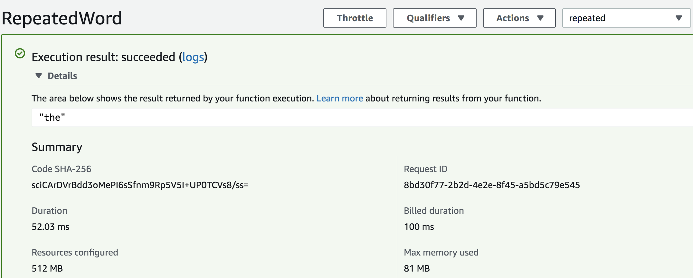
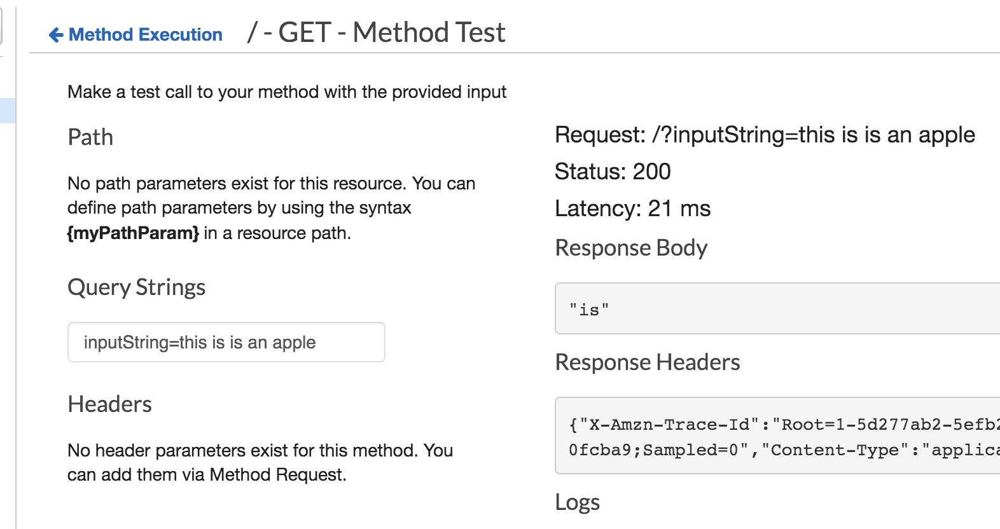
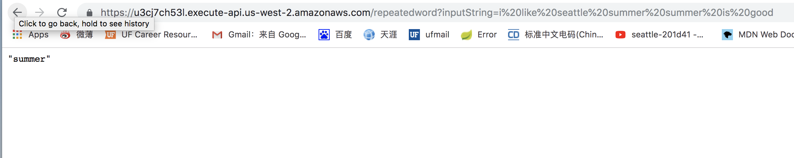

## Lambda API GateWay

Deployed api link: https://u3cj7ch53l.execute-api.us-west-2.amazonaws.com/repeatedword

Need to add following lines in the build.gradle otherwise will get runtime exception on lambda
`apply plugin: 'java'
sourceCompatibility = 1.8
targetCompatibility = 1.8`

Download jdk 8 for this lab because lambda only support java 8 

Api Gateway Integration Request the mapping template add application/json template

## test

### lambda test

### api gateway test

### deployed api link test
